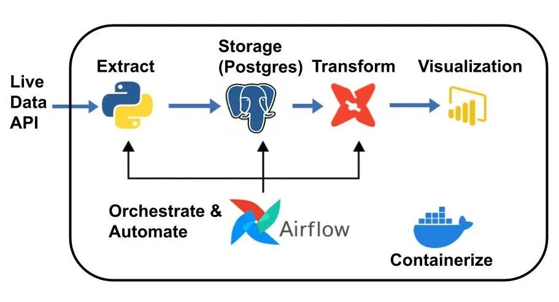

# Weather ETL Pipeline with Airflow & Docker

A production ready data pipeline that automatically fetches weather data from WeatherStack API, processes it, and stores it in PostgreSQL all orchestrated by Apache Airflow and containerized with Docker.

## Project Overview

This pipeline demonstrates key data engineering concepts:
- **Extract**: Fetch real-time weather data from WeatherStack API
- **Transform**: Clean and structure data for analysis
- **Load**: Store data in PostgreSQL database
- **Orchestrate**: Automate with Apache Airflow
- **Containerize**: Deploy anywhere with Docker

The pipeline runs automatically every 6 minutes with built in error handling, automatic retries, and email notifications on failures.

---

##  Architecture




---

## Tools

- **Python 3.12** - ETL logic
- **Apache Airflow** - Workflow orchestration
- **PostgreSQL 14** - Data storage
- **Docker & Docker Compose** - Containerization
- **WeatherStack API** - data source

---

## Prerequisites

Before running this project, ensure you have:

- Docker and Docker Compose installed
- WeatherStack API key ([Get free key here](https://weatherstack.com/))
- Gmail account (for email notifications)

---

##  Quick Start

### 1. Clone the Repository
```bash
git clone https://github.com/alexander784/Weather_pipeline.git
cd weather_pipeline
```

### 2. Set Up API Key
Edit `api_request/api_request.py` and add your WeatherStack API key:
```python
api_url = "https://api.weatherstack.com/current?access_key=YOUR_API_KEY&query=Nairobi"
```

### 3. Configure Email Notifications
Edit `docker-compose.yml` and add your Gmail credentials:
```yaml
AIRFLOW__SMTP__SMTP_USER: your.email@gmail.com
AIRFLOW__SMTP__SMTP_PASSWORD: yourgmailapppassword
```

> **Note**: Use a [Gmail App Password](https://support.google.com/accounts/answer/185833), not your regular password.

### 4. Start the Pipeline
```bash
docker-compose up -d
```

### 5. Access Airflow UI
Open your browser and go to:
```
http://localhost:8000
```

**Default credentials:**
- Username: `admin`
- Password: Check the Airflow logs with `docker logs airflow_container`

---

##  Project Structure

```
weather-etl-pipeline/
├── api_request/
│   ├── __init__.py
│   ├── api_request.py          # API extraction logic
│   └── insert_records.py       # Database loading logic
├── airflow/
│   └── dags/
│       └── weather_dag.py      # Airflow DAG definition
├── postgres/
│   ├── data/                   # PostgreSQL data (auto-generated)
│   └── airflow_init.sql        # Database initialization
├── docker-compose.yml          # Docker services configuration
└── README.md
```

---

## How It Works

### 1. Extract
The `api_request.py` module fetches current weather data:
- City name
- Temperature (°C)
- Weather description
- Wind speed
- Timestamp

### 2. Transform & Load
The `insert_records.py` module:
- Connects to PostgreSQL
- Creates schema and table if they don't exist
- Inserts cleaned data into `dev.raw_weather_data` table

### 3. Orchestrate
Airflow DAG (`weather_dag.py`):
- Runs every 6 minutes
- Retries 3 times on failure (5-min delay between retries)
- Sends email notification if all retries fail

---

## Database Schema

```sql
CREATE TABLE dev.raw_weather_data (
    id SERIAL PRIMARY KEY,
    city TEXT,
    temperature FLOAT,
    weather_descriptions TEXT,
    wind_speed FLOAT,
    time TIMESTAMP,
    inserted_at TIMESTAMP DEFAULT NOW(),
    utc_offset TEXT
);


##  Configuration

### Change Pipeline Schedule
Edit `airflow/dags/weather_dag.py`:
```python
schedule_interval=timedelta(minutes=6)  # Change to your preferred interval
```

### Change City
Edit `api_request/api_request.py`:
```python
api_url = "https://api.weatherstack.com/current?access_key=YOUR_KEY&query=Nairobi"  # Change city
```

```

### Manually Trigger DAG
1. Go to Airflow UI (`http://localhost:8000`)
2. Find `weather-orchestrator` DAG
3. Click the play button to trigger manually

